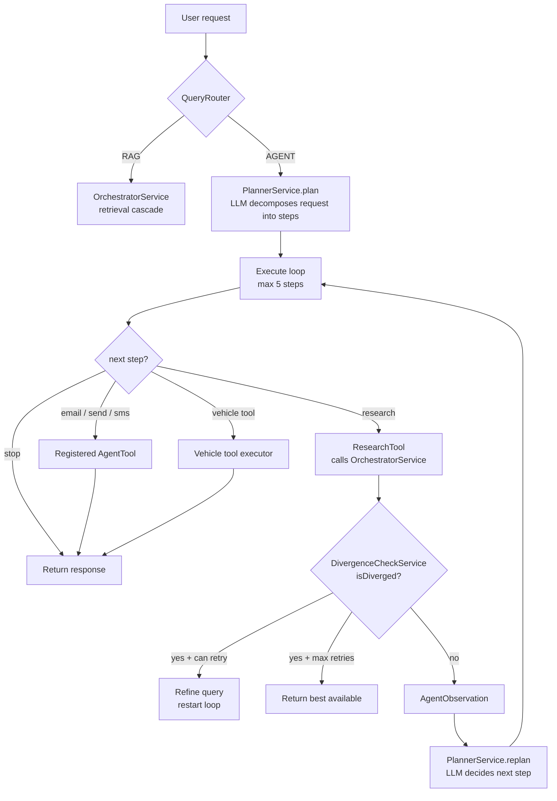
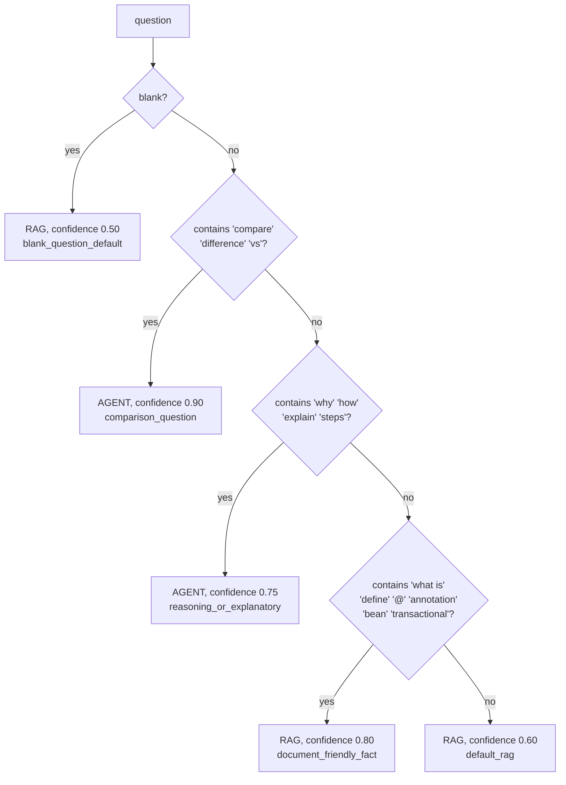
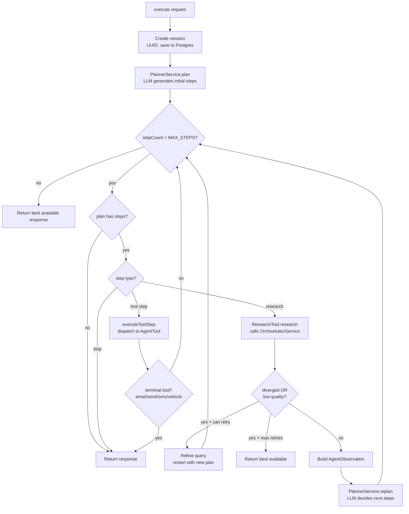
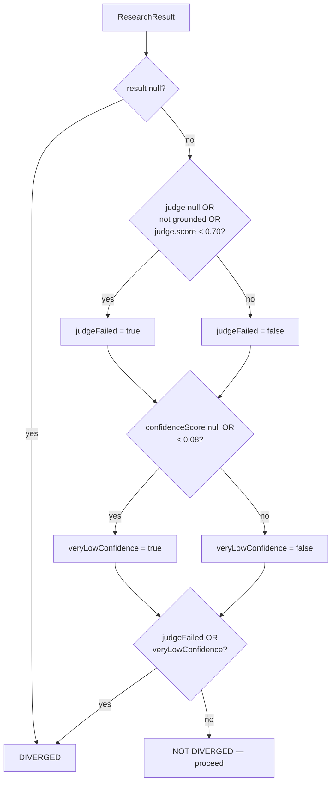
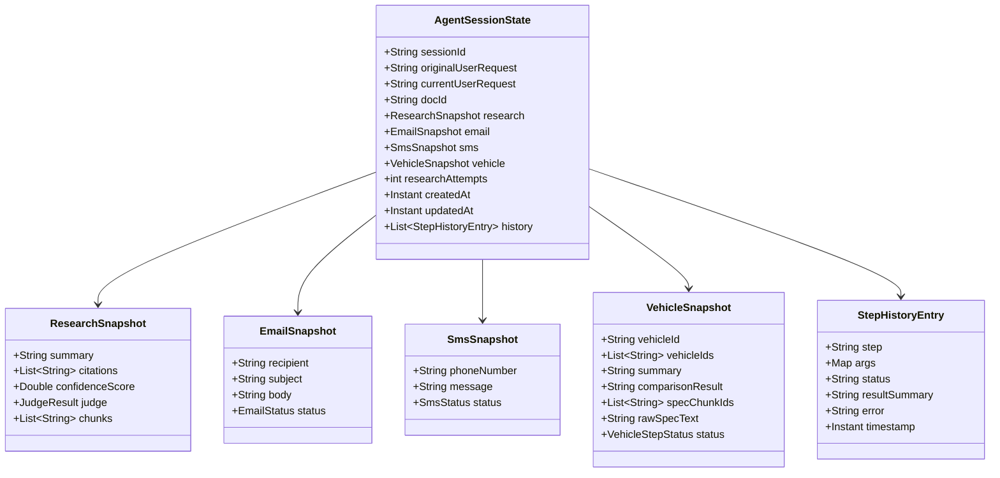
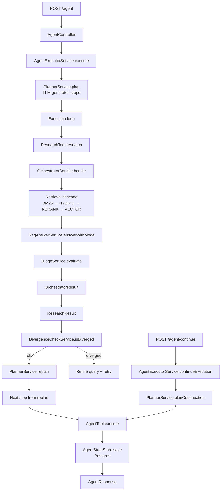

# Architecture Notes — Agent Plan / Replan / Divergence

A walkthrough of the agentic workflow layer that sits on top of the RAG
pipeline. Documents the plan → execute → observe → replan loop, the
divergence detection and fallback system, tool dispatch, session
persistence, and the continuation flow for multi-turn interactions.

> Scope: this document covers the **`AgentController → AgentExecutorService
> → PlannerService → Tools → DivergenceCheckService`** flow. The RAG
> pipeline itself (ingestion, retrieval, answer, orchestrator cascade) is
> documented in `architecture-notes.md`.

---

## 1. System overview

The agent layer adds **multi-step workflow orchestration** on top of the
RAG pipeline. Instead of answering a question directly, it can:

- Decompose a user request into a sequence of steps (plan)
- Execute each step using registered tools
- Observe the result and decide whether to continue, retry, or stop (replan)
- Detect when research quality has diverged and trigger fallback strategies
- Persist the full session state to Postgres for resumability and audit
- Accept follow-up instructions on the same session (continuation)

The architecture follows a **plan → execute → observe → replan** loop
with bounded retries and divergence detection at each research step.



---

## 2. Query routing — RAG vs Agent

`QueryRouter.route(question)` is a keyword-based classifier that decides
whether a question should go through the RAG pipeline directly or through
the agent layer.



The router returns a `RouteDecision(route, confidence, reason)` record.
The confidence score is informational (used in tracing and logging) — it
doesn't affect downstream behavior. The route enum (`RAG` or `AGENT`) is
the binary decision that `OrchestratorService.handle()` branches on.

### Design choice: keyword rules, not LLM classification

The router is deliberately simple — string matching, no LLM call. This is
a design choice, not a limitation. An LLM-based classifier would be more
accurate but would add latency (one more round-trip to Ollama) to every
request, including simple factual questions that don't need agent reasoning.
The keyword approach is fast, deterministic, and easy to debug. For the
current corpus and query shapes, it routes correctly in practice.

### Tradeoffs

| Decision | Pro | Con |
|---|---|---|
| Keyword-based routing | Zero latency, deterministic, debuggable | Misclassifies edge cases; "How much does X cost?" goes to AGENT (contains "how") even though it's a factual lookup |
| Confidence as metadata only | Simpler control flow | Can't use confidence to fall back from AGENT to RAG when the router is unsure |

---

## 3. Planning — LLM-generated step sequences

`PlannerService` has three entry points, each for a different phase:

| Method | When | What it does |
|---|---|---|
| `plan(userPrompt)` | Initial request | LLM decomposes the user request into an ordered step list |
| `replan(state, observation)` | After a research step completes | LLM looks at the result and decides whether to continue with communication steps, retry research, or stop |
| `planContinuation(state, instruction)` | Follow-up from user on existing session | LLM (or keyword shortcuts) generates next steps given the current session state and a new instruction |

### Step vocabulary

The planner operates over a fixed set of step names. Each step maps to a
registered `AgentTool` implementation:

| Step | Args | Tool | Effect |
|---|---|---|---|
| `research` | `query` | `ResearchTool` | Calls `OrchestratorService.handle()` — the full retrieval cascade |
| `email` | `recipient`, `subject` | `EmailToolExecutor` | Generates email body in session state (no side effect) |
| `send` | `recipient`, `subject` | `SendToolExecutor` | Sends email externally |
| `compose_sms` | `phoneNumber` | `SmsToolExecutor` | Generates SMS message in session state (no side effect) |
| `send_sms` | `phoneNumber` | `SendSmsToolExecutor` | Sends SMS externally |
| `draft_email` | `recipient`, `subject` | `DraftEmailToolExecutor` | Persists email draft |
| `shorten_email` | (none) | `ShortenEmailToolExecutor` | Rewrites email body shorter |
| `update_recipient` | `recipient` | `UpdateRecipientToolExecutor` | Changes recipient in session state |
| `fetch_vehicle_specs` | `vehicleId`, `question?`, `topK?` | `FetchVehicleSpecsToolExecutor` | Retrieves raw spec data from vector store |
| `generate_vehicle_summary` | `vehicleId` | `GenerateVehicleSummaryToolExecutor` | Writes consumer narrative from specs |
| `compare_vehicles` | `vehicleIds`, `question` | `CompareVehiclesToolExecutor` | Side-by-side comparison |
| `enrich_vehicle_data` | `vehicleId` | `EnrichVehicleDataToolExecutor` | Improves summary and re-ingests |
| `stop` | (none) | (none — executor returns) | Terminates the loop |

### Plan validation and enforcement

The LLM is asked to return a JSON plan, but LLMs are unreliable JSON
producers. `PlannerService` applies three layers of validation:

1. **JSON extraction** — strips markdown code fences, finds the first
   `{...}` object, strips JS-style comments. Same lenient parsing pattern
   used in `JudgeService`.

2. **Step validation** — each step is checked against an allowlist
   (`INITIAL_ALLOWED_STEPS` or `CONTINUATION_ALLOWED_STEPS` depending on
   the phase). Unknown steps are silently dropped. Required args like
   `query` or `vehicleId` are checked; steps with missing args are dropped.
   Blank or null plans fall back to `stop`.

3. **Execution rule enforcement** — structural constraints that the LLM
   might violate:
   - Email steps are blocked until research has completed (if research is
     in the plan)
   - `send` without a prior `email` step gets downgraded to `email`
   - `send_sms` without prior `compose_sms` gets a `compose_sms` inserted
   - Missing recipients/subjects get safe defaults (`hr@company.com`,
     `Requested Summary`)
   - Vehicle steps pass through without ordering constraints

This three-layer validation means **the planner can produce any garbage
and the system will either fix it or stop safely**. The LLM is treated as
an unreliable suggestion engine, not a trusted controller.

### Tradeoffs

| Decision | Pro | Con |
|---|---|---|
| LLM-generated plans with post-hoc enforcement | Flexible; handles novel requests without code changes | LLM can misunderstand step semantics; enforcement silently drops steps which may confuse debugging |
| Fixed step vocabulary | Type-safe dispatch, easy to audit | Adding a new capability requires adding a step name, a tool, and planner prompt changes |
| Keyword shortcuts in `planContinuation` | Common follow-ups ("send", "shorten", "draft") skip the LLM call entirely — faster and deterministic | Two code paths for continuation (keyword vs LLM); risk of drift between them |

---

## 4. Execution loop — `AgentExecutorService.execute()`

The executor runs the plan → execute → observe → replan loop with
bounded iteration.



### Key execution rules

**Bounded iteration.** `MAX_STEPS = 5` and `MAX_RETRIES = 2` for research.
The loop cannot run forever. If neither bound is hit, the loop also stops
when the plan doesn't advance (no step was executed in an iteration).

**Research is the only step that replans.** After a research step, the
executor builds an `AgentObservation` (last step, answer, confidence,
judge result) and calls `PlannerService.replan()` to let the LLM decide
what to do next. Tool steps (email, send, vehicle) execute and return
immediately without replanning.

**Terminal tools.** Certain tool steps (`email`, `compose_sms`, `send`,
`generate_vehicle_summary`, `compare_vehicles`, `enrich_vehicle_data`)
immediately return the response after execution. They're considered
terminal because they produce the final deliverable the user asked for.

**Side-effect guards.** The executor prevents:
- Email-related steps when research is unresolved (answer is the fallback
  string)
- `send`/`send_email` when the email has already been sent (idempotency)
- `send_sms` when SMS has already been sent
- `draft_email` when an identical draft already exists (same recipient
  and subject)

### Session state persistence

Every state mutation is persisted to Postgres via `AgentStateStore.save()`.
The state is serialized as JSON into an `AgentSessionEntity` row. This
means:

- The full execution history survives process restarts
- The dashboard (`/agent/dashboard`) can show all sessions with their
  step-by-step history
- A failed session can be inspected post-mortem by reading the
  `state_json` column
- Continuation requests (`POST /agent/continue`) can resume from the
  persisted state

### Tradeoffs

| Decision | Pro | Con |
|---|---|---|
| Hard bounds (5 steps, 2 retries) | Prevents runaway loops; predictable cost | May be too aggressive for complex multi-step requests |
| Research-only replanning | Simpler control flow; tools are fire-and-forget | Can't recover from a failed email step by replanning |
| Terminal tools return immediately | User gets a response as soon as the deliverable is ready | No post-tool validation (e.g., checking that the generated email is good) |
| Full state serialized to Postgres | Complete audit trail, resumability | JSON blob in a single column; no queryable structure without parsing |

---

## 5. Divergence detection

`DivergenceCheckService.isDiverged(result)` decides whether a research
result is good enough to proceed or whether the executor should retry.



Two independent signals trigger divergence:

1. **Judge failure** — the LLM-as-judge said the answer isn't grounded,
   or scored it below 0.70, or the judge itself failed to return a result.
2. **Very low confidence** — `bestScore < 0.08`. This is on the RRF
   scale (not cosine), so 0.08 means roughly "rank-1 hit by one retriever
   only." Scores this low indicate retrieval found almost nothing relevant.

### What happens when divergence is detected

Inside `AgentExecutorService.execute()`, divergence triggers one of two
paths:

1. **Can retry** (`researchAttempts < MAX_RETRIES = 2`): the executor
   appends " explained with implementation details, example, and controller
   advice pattern" to the query (a crude but effective refinement), creates
   a new single-research plan, and restarts the loop.

2. **Max retries reached**: the executor immediately returns the best
   available response — whatever the last research attempt produced, even
   if it's the fallback string. This prevents infinite retry loops.

### The `shouldRetryResearch` secondary check

In addition to divergence, the executor has its own retry heuristic:

```java
boolean saysIDontKnow = answer.contains("i don't know based on the ingested documents");
boolean hasChunks = result.chunks() != null && !result.chunks().isEmpty();
double judgeScore = result.judge() != null ? result.judge().score() : 0.0;
boolean lowJudgeScore = judgeScore < 0.60;

return (saysIDontKnow && hasChunks) || lowJudgeScore;
```

This catches a specific failure mode: the retrieval found chunks, but the
answer generation still refused ("I don't know"). This means the refusal
came from the prompt, not from empty retrieval — a different problem than
low confidence, and worth retrying with a refined query.

### The Spring event path (unused in the executor loop)

The codebase also has `DivergenceDetectedEvent` → `DivergenceEventListener`
→ `FallbackService.retryWithBetterQuery()`. This is a Spring `ApplicationEvent`
path that provides an alternative retry mechanism via the event bus. The
`FallbackService` appends " with more details and examples" to the query
and calls `ResearchTool.research()` directly, saving the result back to
the session state store.

This event path is **not called from `AgentExecutorService`** — the
executor handles retries inline. It exists as a hook for other entry
points that might want event-driven divergence handling.

### Tradeoffs

| Decision | Pro | Con |
|---|---|---|
| Two-signal divergence (judge + confidence) | Catches both "answer is wrong" and "retrieval found nothing" | The 0.08 confidence threshold is on the RRF scale only; cosine scores that low would be extreme failures |
| Crude query refinement (append fixed suffix) | Simple, no LLM call for refinement | The suffix is domain-specific ("controller advice pattern"); wouldn't help for vehicle or article queries |
| `MAX_RETRIES = 2` | Prevents infinite loops | Two retries may not be enough for genuinely ambiguous queries |
| Spring event path exists but isn't used by executor | Extensibility hook for future use | Dead-looking code that confuses readers; should be documented or removed |

---

## 6. Continuation — multi-turn agent sessions

After an initial `POST /agent` returns a response, the user can send
follow-up instructions via `POST /agent/continue` with a `sessionId` and
a new `instruction`. This enables multi-turn workflows:

```
User: "Research Spring Boot auto-configuration and email it to me"
  → Agent: research → email → response with sessionId + drafted email

User: "Actually, send it to john@example.com instead"
  → POST /agent/continue { sessionId, instruction: "send to john@..." }
  → Agent: update_recipient → draft_email → response with updated email

User: "Make it shorter and send"
  → POST /agent/continue { sessionId, instruction: "shorten and send" }
  → Agent: shorten_email → draft_email → send_email → response
```

### Continuation planning

`PlannerService.planContinuation(state, instruction)` uses **keyword
shortcuts first, LLM fallback second**:

| User says | Shortcut? | Steps generated |
|---|---|---|
| "send" / "send it" | Yes | `send_email` |
| "shorten" | Yes | `shorten_email` → `draft_email` |
| "draft" | Yes | `draft_email` |
| "text" / "sms" | Yes | `compose_sms` → `send_sms` |
| "send sms" / "text it" | Yes | `send_sms` |
| Anything else | No — LLM call | LLM generates steps from context |

The keyword shortcuts are fast (no LLM call) and cover the most common
follow-ups. For anything more complex, the LLM receives the full session
state (research exists? email status? current recipient? execution
history?) and generates a continuation plan.

### Guards in continuation

- **Already-sent guard**: if the email or SMS has status `SENT`, the
  continuation returns immediately with a "Session already completed"
  history entry. Prevents re-sending.
- **Step allowlists**: continuation steps use `CONTINUATION_ALLOWED_STEPS`
  which is a different (smaller) set than `INITIAL_ALLOWED_STEPS`. No
  `research` in continuation — reuse existing research.

### Tradeoffs

| Decision | Pro | Con |
|---|---|---|
| Keyword shortcuts for common follow-ups | Fast, deterministic, no LLM cost | Two code paths; keyword shortcuts and LLM may disagree on intent |
| Session state passed to continuation LLM | LLM can make context-aware decisions | Large prompt; LLM may hallucinate steps based on state fields |
| No research in continuation | Prevents re-doing expensive retrieval | User can't refine the research question in a follow-up |

---

## 7. Session state model

`AgentSessionState` is an immutable Java record with copy-on-write
`withX()` methods. It holds the complete state of an agent workflow:



### Persistence

`AgentStateStore` serializes the entire state record to JSON and stores
it in a `agent_sessions` Postgres table via Spring Data JPA. Every
`stateStore.save(state)` call creates or updates the row. The state is
deserialized on `get(sessionId)`.

This means the session table contains a complete, self-contained snapshot
of every workflow that has ever run — including the step-by-step execution
history, the research results, the email/SMS content, and the vehicle data.
The dashboard reads this table to show session summaries.

### Why immutable records with `withX()`

The state is a Java `record` — immutable by default. Updates create new
instances via `withResearch(...)`, `withEmail(...)`, etc. This pattern:

- Prevents accidental mutation of shared state between steps
- Makes every state transition explicit and traceable
- Plays well with Postgres persistence (serialize the whole thing, not diffs)
- The `withX()` methods insulate callers from the record constructor — adding
  a new field only requires updating `empty()` and adding one `withX()`

---

## 8. Tool dispatch

Tools implement the `AgentTool` interface:

```java
public interface AgentTool {
    String name();
    AgentSessionState execute(AgentSessionState state, PlanStep step);
}
```

`AgentExecutorService` collects all `AgentTool` beans at startup into a
`Map<String, AgentTool>` keyed by `name()`. During execution, tool lookup
is a map get:

```java
AgentTool tool = tools.get(stepName);
state = tool.execute(state, step);
```

Each tool receives the current state and the step (with args), executes
its logic, and returns a new state with the relevant snapshot updated.
Tools are Spring `@Component` beans, so they can inject any service they
need (LLM client, vector store, email sender, etc.).

### The `ResearchTool` is special

Unlike other tools, `ResearchTool` is not dispatched via the tool map.
The executor handles `research` steps inline in a dedicated `case "research"`
branch because research has additional logic around divergence detection,
retry, and replanning that doesn't fit the simple `execute(state, step)`
interface.

`ResearchTool.research()` itself delegates to `OrchestratorService.handle()`
— so a research step in the agent flow triggers the full retrieval cascade
(BM25 → HYBRID → HYBRID_RERANK → VECTOR → AGENT_FALLBACK) documented in
the main architecture notes.

---

## 9. How everything connects

The full call chain from user request to response:



---

## 10. Where this could be improved

1. **Replace the crude query refinement** ("append fixed suffix") with an
   LLM-generated refinement. The current suffix is domain-specific and
   doesn't generalize to vehicle or article queries. A short LLM call to
   rephrase the query would be more effective.

2. **Add research to continuation flow.** Currently, continuation can't
   request new research — it reuses whatever the initial flow produced.
   For follow-ups like "actually, look up X instead," the user has to
   start a new session.

3. **Clarify or remove the Spring event path.** `DivergenceDetectedEvent`
   → `DivergenceEventListener` → `FallbackService` exists but isn't called
   from the executor. Either wire it in (as an async retry path) or remove
   it to avoid confusion.

4. **Make `MAX_STEPS` and `MAX_RETRIES` configurable.** They're currently
   hardcoded constants. Exposing them as Spring properties (`agent.max-steps`,
   `agent.max-retries`) would let operators tune them per environment.

5. **Add post-tool validation.** Currently, tool steps execute and return
   without validation. Adding a judge check after email generation (is the
   email grounded in the research?) would catch cases where the email tool
   hallucinates content not in the research summary.

6. **Structured step history querying.** The execution history is stored
   as part of the JSON blob in `state_json`. Extracting step history into
   its own table (or using Postgres JSON operators) would enable queries
   like "which queries consistently hit MAX_RETRIES?" without parsing
   blobs.

---

## Appendix: file map

| File | Role |
|---|---|
| `router/QueryRouter.java` | Keyword-based RAG-vs-AGENT classifier |
| `router/RouteDecision.java` | `record(route, confidence, reason)` |
| `agent/AgentService.java` | Simpler agent entry point (used by orchestrator cascade's AGENT_FALLBACK) |
| `agentic/AgentController.java` | HTTP endpoints: `POST /agent`, `POST /agent/continue`, `GET /agent/{id}` |
| `agentic/AgentExecutorService.java` | Plan → execute → observe → replan loop |
| `agentic/PlannerService.java` | LLM-powered planner with validation and enforcement |
| `agentic/AgentSessionRunner.java` | Simpler session wrapper (used by RAG-only flows for session tracking) |
| `agentic/divergence/DivergenceCheckService.java` | Two-signal divergence detector |
| `agentic/divergence/DivergenceDetectedEvent.java` | Spring event (unused by executor) |
| `agentic/divergence/DivergenceEventListener.java` | Event listener → FallbackService |
| `agentic/divergence/FallbackService.java` | Retry with improved query via event path |
| `agentic/state/AgentSessionState.java` | Immutable session record with snapshots |
| `agentic/state/AgentStateStore.java` | JSON serialization to Postgres |
| `agentic/state/StepHistoryEntry.java` | `record(step, args, status, result, error, timestamp)` |
| `agentic/dto/AgentPlan.java` | `record(List<PlanStep>)` |
| `agentic/dto/PlanStep.java` | `record(step, args)` |
| `agentic/dto/AgentObservation.java` | `record(lastStep, summary, confidence, judge)` |
| `agentic/dto/ResearchResult.java` | `record(answer, citations, confidence, judge, chunks)` |
| `agentic/dto/AgentTool.java` | Interface: `name()` + `execute(state, step)` |
| `agentic/tools/ResearchTool.java` | Wraps `OrchestratorService.handle()` |
| `agentic/tools/*.java` | Email, SMS, vehicle tool executors |
