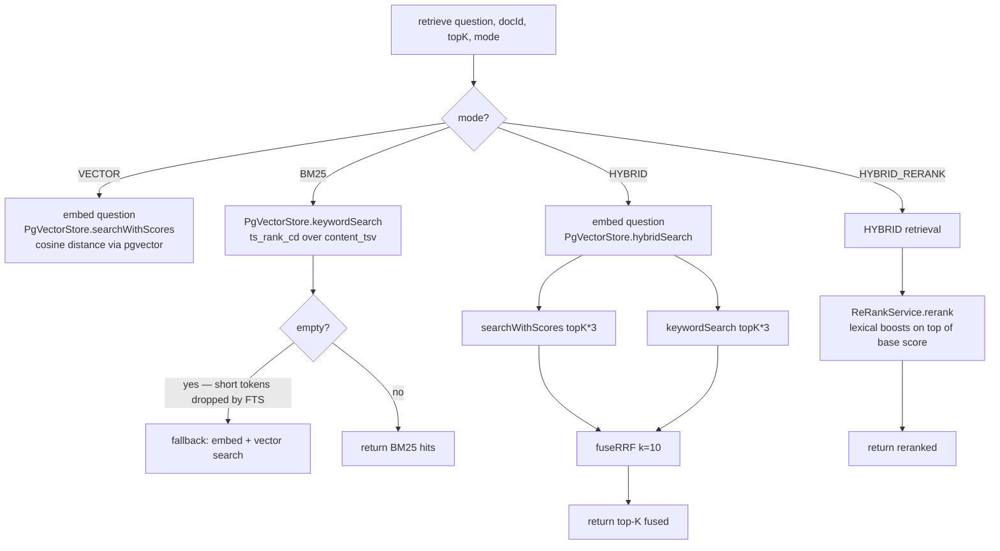
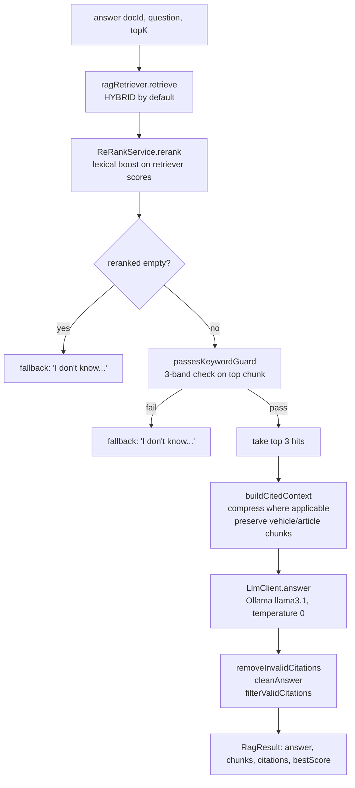
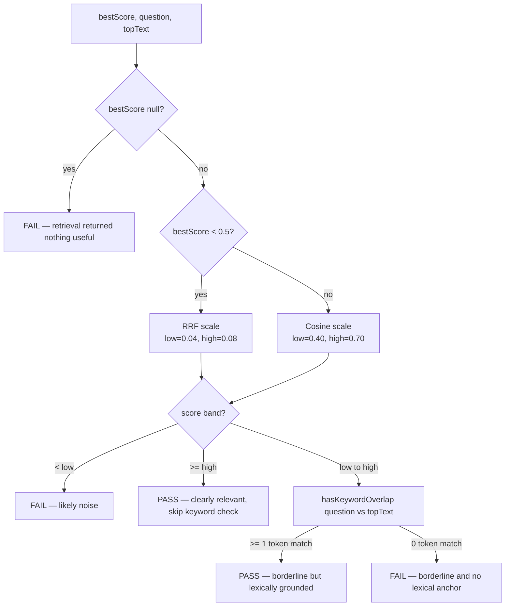
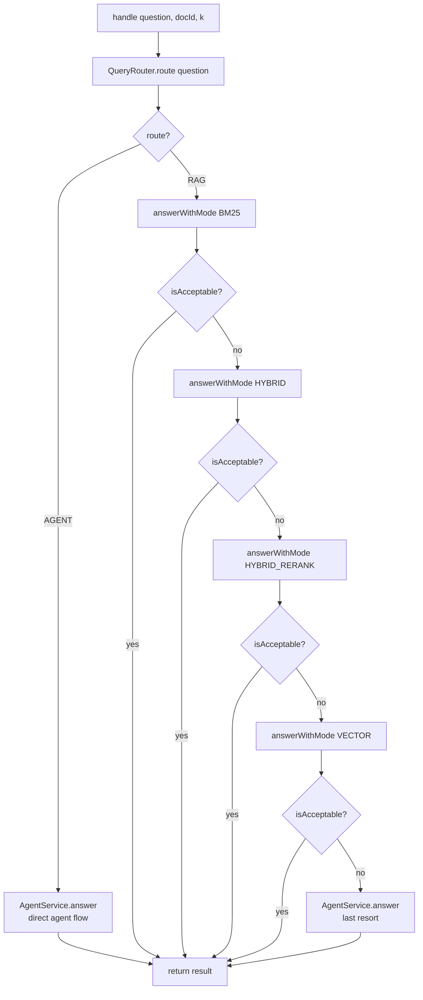
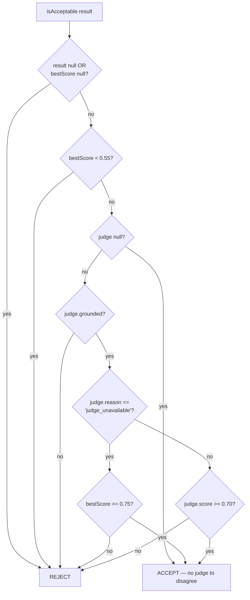
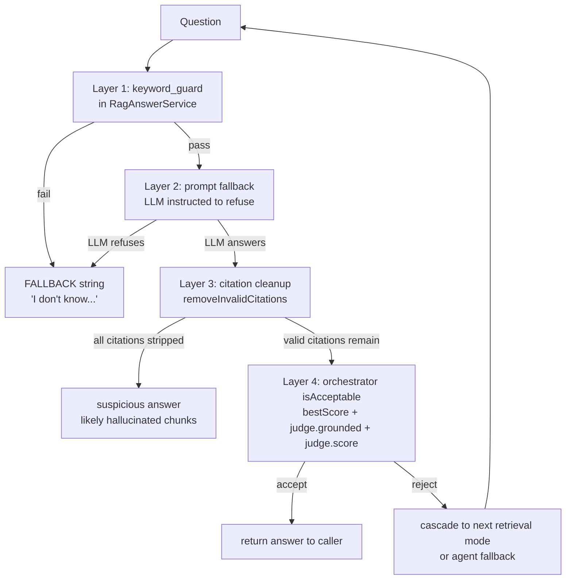

# Architecture Notes — Java RAG Pipeline

A walkthrough of the ingestion, retrieval, and answer flows in the custom Java
pipeline. Documents what the code actually does, the tradeoffs at each design
decision, and where the failure-handling seams are.

> Scope: this document covers the **PDF/Q&A ingestion path** and the
> **`OrchestratorService → RagAnswerService → RagRetriever → PgVectorStore`**
> answer path. Article and vehicle ingestion follow the same shape via their own
> services. The agent plan/replan flow (`AgentService`, `AgentSessionRunner`)
> is documented separately.

---

## 1. Ingestion

### Flow



```mermaid
flowchart TD
    Client[Client] -->|POST /api/ingest-pdf| Controller[IngestionController]
    Controller --> Service[IngestionService]
    Service --> Extract[PdfExtractorService<br/>pdfbox PDFTextStripper]
    Extract --> Chunk[TextChunker<br/>split on Q&#92;d+&#92;.]
    Chunk --> Empty{chunks empty?}
    Empty -->|yes| Err[throw IllegalArgumentException]
    Empty -->|no| Delete[ChunkStorageService.deleteByDocId<br/>delete prior chunks for this docId]
    Delete --> Loop[for each chunk i:<br/>embed via Ollama nomic-embed-text<br/>insert into document_chunks]
    Loop --> Resp[IngestResponse<br/>docId, fileName, chunkCount, status]
```

### Key decisions

**docId is the unit of replacement, not the file.**
`ChunkStorageService.deleteByDocId` runs before any inserts, so re-ingesting the
same `docId` is idempotent — old chunks vanish, new chunks take their place.
The HTTP endpoint accepts an optional `docId` parameter; if absent, one is
auto-generated from the filename plus a timestamp. Every PDF re-upload thus
creates a *new* corpus entry by default; passing an explicit stable `docId` is
how callers opt into replacement semantics.

**Chunking is FAQ-shaped, not generic.**
`TextChunker.chunk()` splits on the regex `(?=Q\d+\.)` — a positive lookahead
that breaks the document at every `Q1.`, `Q2.`, etc. marker without consuming
them. This is **deliberately tuned for the interview-Q&A source format** and
intentionally *not* a generic sentence/paragraph splitter. For Q&A docs it
produces clean per-question chunks. For docs without Q-markers, it returns
the whole document as a single chunk — which is a known limitation, not a
bug. The vehicle and article ingestion paths use their own builders
(`VehicleChunkBuilder`, `ArticleChunkBuilder`) that produce structured
single-line chunks for their respective domains.

**Embedding is one-at-a-time, not batched.**
`EmbeddingService.embed(text)` makes one HTTP call to Ollama per chunk. For
small docs (10–20 chunks) this is fine. For large docs it's the bottleneck.
Batching via `embed(List<String>)` would be a straightforward improvement
when ingesting thousands of chunks.

**Storage is plain JDBC.**
`ChunkStorageService.saveChunk` builds the pgvector literal as a string (e.g.
`[0.013,-0.024,...]`) and inserts via `JdbcTemplate.update`. No JPA, no
Spring Data, no embedding-specific abstractions. The tradeoff: less magic,
more visible SQL, but you own the cast to `?::vector` and the responsibility
for keeping the schema in sync.

### Tradeoffs

| Design choice | Pro | Con |
|---|---|---|
| Delete-then-insert by docId | Simple, idempotent, easy to reason about | Two SQL round-trips per ingest, brief window where the doc has zero chunks |
| Regex chunking on `Q\d+\.` | Perfect for FAQ source format, semantic boundaries | Falls back to one giant chunk for non-FAQ docs; needs separate builders for other shapes |
| Per-chunk embedding HTTP call | No batch-size tuning, simple error handling | Latency proportional to chunk count; ~1 RTT × N for an N-chunk doc |
| Raw `JdbcTemplate` over Spring Data | SQL is visible, no ORM surprises | More boilerplate, no entity-level conveniences |

---

## 2. Retrieval

### The four modes

`RagRetriever.retrieve(docId, question, topK, mode)` dispatches to one of
four strategies depending on the requested `RetrievalMode`:



### Score scales — incompatible across modes

This is the most important fact to internalize about retrieval. The `score`
field on `SearchHit` means three different things depending on which mode
produced it:

| Mode | Score formula | Range | Higher = better |
|---|---|---|---|
| `VECTOR` | `1 - cosine_distance` | 0–1 | yes |
| `BM25` | `ts_rank_cd(content_tsv, plainto_tsquery)` | 0+ unbounded | yes |
| `HYBRID` | `1/(10+rank_v) + 1/(10+rank_b)` | ~0.04–0.18 | yes |
| `HYBRID_RERANK` | RRF score × 0.85 + lexical boosts (max ~0.30) | ~0.05–0.30 | yes |

**You cannot compare scores across modes.** A vector score of 0.50 ("decent")
and an RRF score of 0.05 ("rank 1, found by one retriever") could correspond
to the same chunk being equally good in both modes. The downstream gating
logic (`passesKeywordGuard`) handles this by sniffing the score range and
applying the right threshold.

### RRF fusion — why `k=10` is intentional

Reciprocal rank fusion combines two ranked lists by scoring each chunk as
`1/(k + rank)` from each list and summing. The `k` constant controls how
sharply rank position matters:

| k | rank-1 score | rank-5 score | rank-1 vs rank-5 spread |
|---|---|---|---|
| 60 (textbook default) | 0.0164 | 0.0154 | ~6% |
| 10 (this codebase) | 0.0909 | 0.0667 | ~36% |
| 1 | 0.5000 | 0.1667 | ~3x |

`k=10` was chosen because at the textbook `k=60`, the rank-1-vs-rank-5 spread
is so small that a confident vector hit dominates fusion regardless of
where BM25 ranks the chunk — defeating the point of running BM25 in the
first place. Lowering `k` to 10 gives BM25's vote enough weight to actually
move the needle. This is a real tuning decision, not a default.

### BM25 fallback for short tokens

Postgres full-text search with `plainto_tsquery('english', ...)` drops tokens
shorter than 3 characters during lexeme normalization. So a question like
"What engine does the M3 use?" produces an FTS query with `engine` and `use`
but **not** `m3`. For docs where the answer requires the short-token match
(vehicle specs, version numbers, flag names like `-Xms`), BM25 returns zero
hits.

`RagRetriever.BM25` mode catches this case and **falls back to vector search**
when BM25 returns empty, ensuring queries about short tokens still get an
answer. Without this fallback, BM25 mode would silently fail on a class of
questions that vector retrieval handles well.

### Tradeoffs

| Design choice | Pro | Con |
|---|---|---|
| Four retrieval modes | Right tool for each query shape | Score-scale heterogeneity; downstream code must sniff which mode produced a score |
| Hybrid via in-app RRF (Java loop) | Total control over fusion math, easy to tune `k` | Doesn't scale to massive corpora — fusion happens in Java memory |
| `k=10` instead of textbook `k=60` | BM25 contributes meaningfully to fusion | Non-standard; reviewers expecting textbook RRF may be surprised |
| Vector fallback in BM25 mode | Short-token queries don't silently fail | Ambiguity: caller asked for BM25, got vector. Logged at DEBUG but invisible at INFO |
| `ts_rank_cd` for BM25 | Native pg, no extra service, GIN index scales | English-only stemming; not language-aware for multilingual corpora |

---

## 3. Answer

The default entry point is `RagAnswerService.answer(docId, question, topK)` —
which delegates retrieval to `RagRetriever` (HYBRID by default), reranks
the results, gates the top hit, builds context, calls the LLM, and returns
either an answer or the fallback string. There is also `answerWithMode(...)`
which lets the caller pick the retrieval mode explicitly — used by
`OrchestratorService` to try multiple modes in sequence (see §4).

### Flow



### The keyword guard — three bands, two score scales

`passesKeywordGuard(question, bestScore, topText)` is the gate that decides
whether retrieval was good enough to call the LLM. It operates in three
bands depending on the magnitude of `bestScore`:



The `bestScore < 0.5` heuristic auto-detects which scale the score is on:
RRF scores top out around 0.18 by design (with `k=10`), so anything below 0.5
must be RRF; anything above must be cosine similarity. This lets the same gate
handle all four retrieval modes without the caller telling it which one
produced the score.

The three-band design is the key insight:

- Below `low`: too weak, refuse without further checks
- Above `high`: strong enough that semantic match alone is trusted, skip keyword check
- In between: borderline — require at least one keyword overlap as a tiebreaker

This catches the failure mode where embedding similarity is moderately high
but the chunk is actually about a different topic. A chunk about "@Repository
exception translation" might score 0.50 against "How do I configure heap
size?" — high enough to look promising, but no token overlap means the
embedding got fooled by surface similarity.

### Score thresholds

| Constant | Value | Used in |
|---|---|---|
| `COSINE_LOW` | 0.40 | Floor for cosine-scale scores; was 0.55, relaxed for structured chunks |
| `COSINE_HIGH` | 0.70 | Threshold above which keyword check is skipped (was 0.80) |
| `RRF_LOW` | 0.04 | Floor for RRF-scale scores (~rank-3-by-one-retriever) |
| `RRF_HIGH` | 0.08 | Threshold above which keyword check is skipped (~rank-1-by-both-retrievers) |

The relaxation from `COSINE_LOW=0.55` to `0.40` is documented in the source
as "relaxed for structured chunks" — empirically determined that 0.55 was
too strict on FAQ and tabular content where the right chunk was being
filtered out at borderline scores.

### Two prompts, one purpose

`buildDefaultPrompt(question)` (used by `answer()`) and `buildStrictPrompt(question)`
(used by `answerWithMode()`) both instruct the LLM to:

1. Answer using ONLY the provided context
2. Cite chunks inline in `[docId:chunkIndex]` format
3. Reply with exactly the fallback string if context doesn't support an answer

The strict variant adds more aggressive constraints around answer length,
citation placement, and forbidden phrasings (no "according to the context",
no notes/commentary, no leading citations). Both rely on prompt instructions
rather than structured generation, which means the LLM can still misbehave —
the citation cleanup steps (`removeInvalidCitations`, `filterValidCitations`)
exist precisely to catch when the model hallucinates citations to nonexistent
chunks.

### Context compression

`buildCitedContext` calls `compress(text)` on each chunk before sending it to
the LLM. Compression rules:

- **Vehicle and article chunks pass through untouched** (`isVehicleChunk` matches
  on first-line patterns from the structured builders). These chunks are dense
  single-line prose that the compress filter would silently wipe.
- **For other chunks** (FAQ-style PDFs), compress prefers the "Interview Answer"
  section if present, then falls back to the first sentence containing
  " is a " / " is an " (a definitional pattern), then to the first 10 lines
  under 400 characters.
- Lines containing SQL, equals-banner separators (`===`), or timing fragments
  (` ns `, ` ms `) are stripped as boilerplate.

This is hand-tuned for the corpus shape and would need adjustment for other
content types — another instance where the FAQ-shaped origin of the codebase
shows through.

### Citation cleanup pipeline

After the LLM returns text:

1. **`removeInvalidCitations`** — regex-finds every `[docId:N]` pattern in the
   answer and strips any that don't appear in the actual retrieved chunk IDs.
   Catches LLM hallucinations like `[doc:99]` when only `[doc:0..2]` were
   retrieved.
2. **`cleanAnswer`** — strips a leading citation if the LLM violated the
   "don't start with a citation" rule, normalizes excessive whitespace, and
   removes the fallback string from the middle of an otherwise valid answer
   (defensive — the prompt forbids this but Llama occasionally does it anyway).
3. **`filterValidCitations`** — extracts the surviving citation IDs into a
   structured list returned to the caller as `RagResult.citedChunkIds`.

The result is that callers can trust `citedChunkIds` to contain only references
to chunks that were actually in the retrieval set — even if the LLM tried to
fabricate.

### Tradeoffs

| Design choice | Pro | Con |
|---|---|---|
| 3-band keyword guard with auto-scale-detect | Same gate handles all 4 retrieval modes | The `< 0.5` sniff is a magic number; would break if RRF scoring changed |
| Prompt-driven refusal + post-hoc cleanup | LLM-agnostic, no special structured output API | Vulnerable to LLM ignoring the instruction; relies on cleanup as a safety net |
| Hand-tuned `compress()` with chunk-type detection | Right level of detail for FAQ vs vehicle vs article | Must update `isVehicleChunk` regex when adding new structured content types |
| Citation cleanup as a regex pipeline | Catches LLM-fabricated citations cheaply | Cannot detect when LLM cites a real chunk for the wrong claim |
| Two prompt variants (default vs strict) | Strict mode for orchestrator's quality-bar attempts | Two prompts to maintain in sync; risk of drift |


## 4. Orchestration — the cascade

`OrchestratorService.handle(question, docId, k)` is what `/ask` actually calls.
It decides between a RAG flow and an agent flow via `QueryRouter`, and for
RAG flows it tries multiple retrieval modes in sequence, accepting the first
one that meets quality bars.

### Cascade flow



### Why this order

`BM25 → HYBRID → HYBRID_RERANK → VECTOR → AGENT` is not arbitrary. It's a
**cost-vs-coverage cascade**:

1. **BM25 first** — cheapest (one SQL call, no embedding), highest precision
   when the question's literal terms appear in the answer chunk. If BM25 nails
   it, no need for fancier methods.
2. **HYBRID second** — adds embedding cost (one Ollama call) and fusion cost.
   Catches questions where vector similarity is needed but BM25 still
   contributes useful keyword anchoring.
3. **HYBRID_RERANK third** — same cost as HYBRID plus the rerank step. Better
   ordering when the borderline ranks matter for what survives the keyword
   guard.
4. **VECTOR last among retrievers** — pure semantic match. Used when keyword
   methods all failed, typically because the question's vocabulary doesn't
   appear verbatim in the doc.
5. **AGENT_FALLBACK** — when no retrieval mode produced an acceptable answer,
   delegate to `AgentService` which can decompose the question, call tools,
   and reason multi-step.

Each attempt's outcome is traced via `TraceHelper` with `attempt_mode`,
`accepted`, `outcome`, `best_score`, and the full judge result — so you can
see in LangSmith exactly which step in the cascade succeeded for each query.

### `isAcceptable` — the quality bar



Three different acceptance criteria layered:

- **Hard score floor** — `bestScore >= 0.55` regardless of anything else.
  Below this, retrieval was definitively too weak.
- **Judge grounded check** — if the judge ran and said "not grounded", reject.
  This catches cases where retrieval looked OK but the LLM's answer drifted.
- **Judge confidence** — `judge.score >= 0.70`. Below this, the judge has
  doubts and the cascade tries the next mode.

The `judge_unavailable` branch is the interesting one: if the judge call
itself failed (Ollama timeout, JSON parse failure twice in a row), the result
is accepted **only if the retrieval score is exceptionally high** (>= 0.75).
This is fail-safe behavior — when you can't get a quality signal from the
judge, fall back to trusting only very high-confidence retrieval.

### When the judge is and isn't called

`buildRagResult` decides whether to invoke the judge:

```java
boolean shouldJudge =
    "AGENT".equals(routeUsed) ||
    "AGENT_FALLBACK".equals(routeUsed) ||
    (result.bestScore() != null && result.bestScore() >= 0.15);
```

So the judge runs:

- Always for agent paths (where the answer is multi-step and most needs validation)
- For RAG paths, **only when bestScore >= 0.15** — skipping the judge for
  totally-failed retrievals saves an LLM call when the score gate is clearly
  going to reject anyway.

### Tradeoffs

| Design choice | Pro | Con |
|---|---|---|
| Cascade through 4 retrieval modes | Best-of-many strategy; some questions favor BM25, others vector | Up to 4× the retrieval cost in worst case before hitting the agent fallback |
| `isAcceptable` combines score + judge | Two independent signals make false-accept rare | Two failure modes also; both can reject when retrieval is actually fine |
| Judge skipped for very low scores | Saves LLM call when retrieval is hopeless | The 0.15 floor is a magic number; not the same as the keyword-guard floors |
| Agent fallback as last resort | No "I have no answer at all" outcomes | Agent is expensive; cascade may take 30s+ before reaching it |
| Each attempt traced separately | LangSmith spans show exactly which mode produced the final answer | More span volume in tracing storage |

---

## 5. Failure handling — the four-layer refusal architecture

Across the full pipeline, refusal can be triggered at four layers, each
catching a different failure mode:



| Layer | Where | Catches |
|---|---|---|
| 1. Keyword guard | `RagAnswerService.passesKeywordGuard` | Retrieval found nothing relevant, OR top chunk is semantically similar but topically wrong |
| 2. Prompt-instructed refusal | LLM prompt template | Cases where the LLM itself recognizes the context can't support the question |
| 3. Citation cleanup | `removeInvalidCitations` / `filterValidCitations` | LLM cited chunks that don't exist (hallucinated references) |
| 4. Orchestrator quality bar | `OrchestratorService.isAcceptable` | Retrieval AND LLM produced an answer, but judge says it's not grounded or score is too low |

Each layer is independently effective — layers 1 and 2 prevent the LLM call
or constrain its output, layer 3 sanitizes after the fact, layer 4 makes the
"try again with a different mode" decision. Together they implement defense
in depth: a single failure in any one layer doesn't propagate.

---

## 6. Where this could be improved

Concrete next steps, ordered by ROI:

1. **Delete the dead `passesMinimumThreshold` and `selectUsableHits`** — they
   confuse readers (you'd think they were called somewhere). 5-minute fix.

2. **Batch embedding in ingestion** — `EmbeddingService.embed` is one HTTP
   call per chunk. Adding `embedAll(List<String>)` would cut large-doc
   ingestion time by 5–10x. Ollama supports batched embedding requests.

3. **Make the cascade order configurable** — `OrchestratorService.handle`
   hardcodes `BM25 → HYBRID → HYBRID_RERANK → VECTOR → AGENT`. For
   workloads where vector retrieval is consistently best (like this corpus),
   trying BM25 first is wasted cost. A per-tenant or per-doc-type ordering
   would skip wasted attempts.

4. **Persist the retrieval-attempt history** to a table for offline analysis.
   Right now LangSmith captures it, but having it in pg would let you query
   "which questions consistently fall through to AGENT_FALLBACK?" with SQL.

5. **Add a "skip judge" flag to `OrchestratorResult`** for caller-driven
   performance tuning. Streaming UIs that need first-token latency may not
   want to wait for the judge — surface that as a config rather than a code
   change.

6. **Replace the magic `bestScore < 0.5` sniff** in `passesKeywordGuard` with
   an explicit `RetrievalMode` parameter. Right now the gate has to infer
   which scale it's on; the caller already knows. Cleaner, less fragile.

---

## Appendix: file map

| File | Role |
|---|---|
| `pdf/IngestionController.java` | HTTP entry for `/api/ingest-pdf` |
| `pdf/IngestionService.java` | Orchestrates extract → chunk → embed → store |
| `pdf/PdfExtractorService.java` | pdfbox text extraction |
| `pdf/TextChunker.java` | Regex split on `Q\d+\.` |
| `pdf/EmbeddingService.java` | Wraps `OllamaEmbeddingClient` |
| `pdf/ChunkStorageService.java` | Inserts/deletes chunks via JDBC |
| `rag/PgVectorStore.java` | All SQL: vector / keyword / hybrid / RRF fusion |
| `rag/RagRetriever.java` | Mode dispatcher (VECTOR/BM25/HYBRID/HYBRID_RERANK) |
| `rag/ReRankService.java` | Lexical reranker with phrase/overlap/term boosts |
| `rag/RagAnswerService.java` | Gating + prompt + LLM call + citation cleanup |
| `rag/RetrievalMode.java` | Enum for the four modes |
| `rag/SearchHit.java`, `VectorRecord.java` | DTOs |
| `router/OrchestratorService.java` | Cascade through retrieval modes + agent fallback |
| `router/QueryRouter.java` | Initial RAG-vs-AGENT decision |
| `judge/JudgeService.java` | LLM-as-judge with retry + fallback to "judge_unavailable" |
| `LlmClient.java`, `OllamaClient.java`, `OpenAiClient.java`, `LlmRouter.java` | LLM call layer |
| `AskController.java` | HTTP entry for `/ask` |
