# Architecture Notes — Tool Flows & Domain Ingestion

Detailed walkthrough of the four remaining undocumented flows:
vehicle tool chain, email/SMS lifecycle, vehicle ingestion, and
article ingestion.

> Prerequisite reading: `architecture-notes.md` (RAG pipeline) and
> `agent-architecture-notes.md` (plan/replan/divergence loop). This
> document covers the tools those systems dispatch to and the ingestion
> pipelines that feed them data.

---

## 1. Vehicle tool chain

Four tools that operate on vehicle data in the vector store. They can
be combined by the planner into multi-step sequences.

### Tool dependency graph

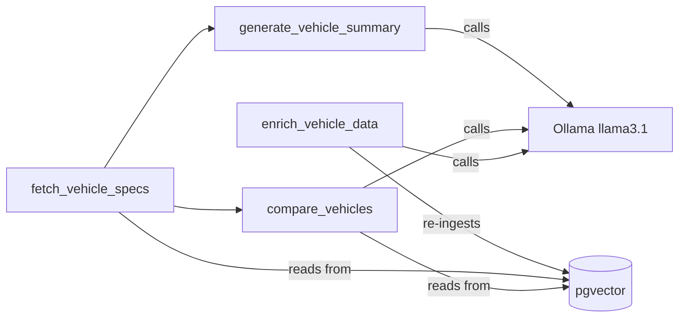

### 1.1 `fetch_vehicle_specs`

**What it does:** retrieves the top-K spec chunks for a vehicle from
pgvector using vector search scoped to a specific `vehicleId` as the
`doc_id`.

**Flow:**

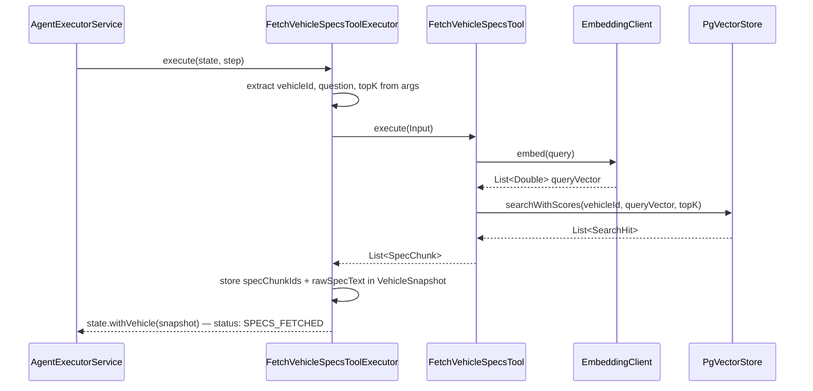

**Key details:**

- If `question` is null/blank, uses a generic fallback query:
  `"vehicle specifications engine horsepower features"`. This ensures
  the embedding still captures the full spec domain even when the user's
  question is just "tell me about the BMW M3."
- Default `topK = 3`. The planner can override via args.
- Stores both `specChunkIds` and `rawSpecText` in `VehicleSnapshot` so
  the next tool (`generate_vehicle_summary`) doesn't need to re-fetch.

**Files:** `FetchVehicleSpecsToolExecutor.java`, `FetchVehicleSpecsTool.java`

---

### 1.2 `generate_vehicle_summary`

**What it does:** takes the spec chunks already in session state (from
`fetch_vehicle_specs`) and asks the LLM to write a consumer-friendly
narrative summary.

**Flow:**

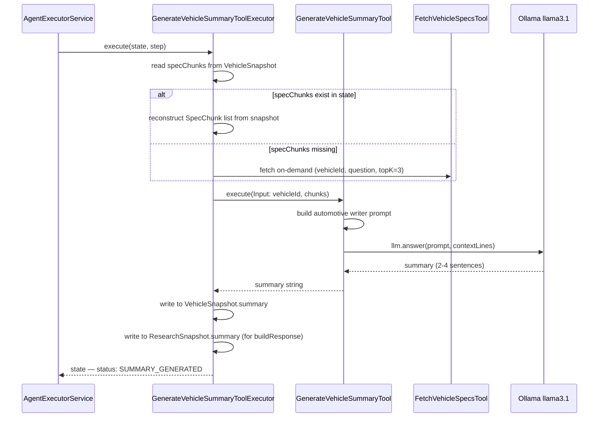

**Key details:**

- The prompt instructs the LLM: "You are an automotive content writer.
  Write a concise, consumer-friendly summary (2–4 sentences). Focus on
  powertrain, key performance figures, standout features, and price.
  Do NOT include citations or chunk IDs."
- The summary is written to **both** `VehicleSnapshot.summary` and
  `ResearchSnapshot.summary`. This dual-write is intentional —
  `buildResponse()` reads from `ResearchSnapshot` to return the answer
  to the caller, while `VehicleSnapshot` holds it for downstream tools.
- If `fetch_vehicle_specs` wasn't called first, the executor fetches
  on-demand. This makes the planner's job easier — it can skip
  `fetch_vehicle_specs` and just call `generate_vehicle_summary` directly.

**Files:** `GenerateVehicleSummaryToolExecutor.java`, `GenerateVehicleSummaryTool.java`

---

### 1.3 `compare_vehicles`

**What it does:** compares two or more vehicles side-by-side on a
specific dimension using an LLM with spec chunks as context.

**Flow:**

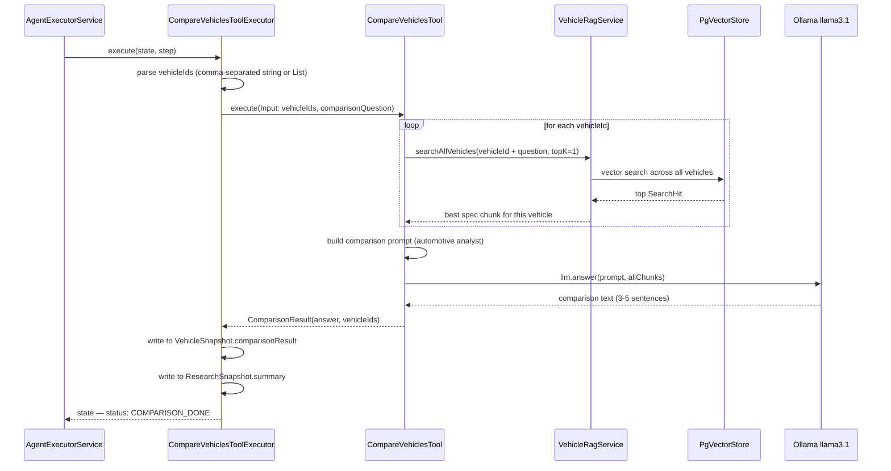

**Key details:**

- Unlike `fetch_vehicle_specs` which scopes search to one `doc_id`,
  comparison uses `VehicleRagService.searchAllVehicles()` — a cross-vehicle
  search that queries the entire vehicle corpus. For each vehicleId, it
  concatenates `vehicleId + " " + question` as the query to bias results
  toward that vehicle's relevant specs.
- Only fetches `topK=1` per vehicle — the comparison prompt gets one
  chunk per vehicle, not many. This keeps the LLM context focused.
- The prompt: "You are an automotive analyst. Compare the following
  vehicles. State clear winners/trade-offs where the data supports it.
  Do NOT include chunk IDs."
- `vehicleIds` can be passed as either a comma-separated string
  (`"bmw-m3-2025,porsche-911-2025"`) or a JSON list. The executor
  handles both via `parseVehicleIds()`.

**Files:** `CompareVehiclesToolExecutor.java`, `CompareVehiclesTool.java`

---

### 1.4 `enrich_vehicle_data`

**What it does:** auto-generates a summary for a vehicle using the LLM,
then **re-ingests the enriched record** back into pgvector so the
embedding reflects the new summary.

**Flow:**

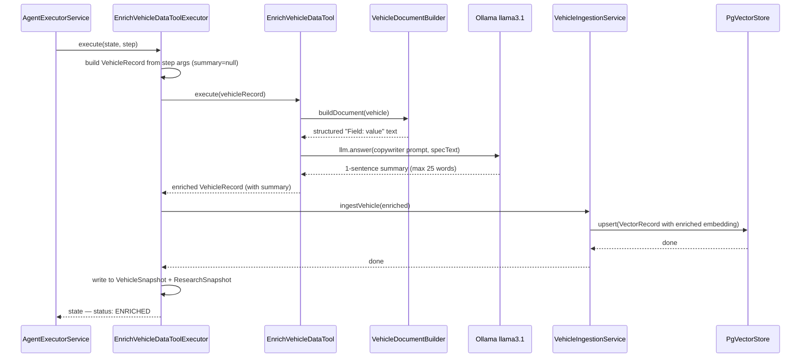

**Key details:**

- This is the **only vehicle tool that writes to the vector store**. The
  others only read.
- If the vehicle already has a summary, `EnrichVehicleDataTool.execute()`
  returns immediately without calling the LLM — idempotent.
- The prompt: "Write ONE concise sentence (max 25 words) summarising
  this vehicle's key selling points." This produces a short tagline-style
  summary, not a full paragraph.
- The enriched record is re-ingested via `VehicleIngestionService.ingestVehicle()`
  which calls `PgVectorStore.upsert()` — so the new embedding includes
  the summary text, improving future retrieval quality.
- Can be used as a standalone pass ("enrich all vehicles") or as part of
  an agent workflow ("fetch specs, generate summary, enrich and re-ingest").

**Files:** `EnrichVehicleDataToolExecutor.java`, `EnrichVehicleDataTool.java`

---

### Vehicle tool tradeoffs

| Decision | Pro | Con |
|---|---|---|
| Dual-write to VehicleSnapshot + ResearchSnapshot | `buildResponse()` works uniformly for all tool types | Two places to read the answer; easy to forget one |
| On-demand fetch in `generate_vehicle_summary` | Planner doesn't have to include `fetch_vehicle_specs` first | Implicit dependency; reconstructed chunks from `rawSpecText` lose individual chunk boundaries |
| `topK=1` per vehicle in comparison | Focused context, fewer tokens to LLM | May miss critical specs if they're in a lower-ranked chunk |
| Enrich re-ingests via upsert | Vector store stays current, future queries benefit | Side effect inside a tool — tool execution modifies the corpus |
| 25-word summary ceiling | Forces conciseness, good embedding density | May lose important details for complex vehicles |

---

## 2. Email / SMS tool chain

The email and SMS tools manage a multi-step lifecycle where content is
generated, optionally modified, and then sent externally. All mutations
happen through the immutable `AgentSessionState` — tools read from
state, compute a new snapshot, and return the updated state.

### Email lifecycle

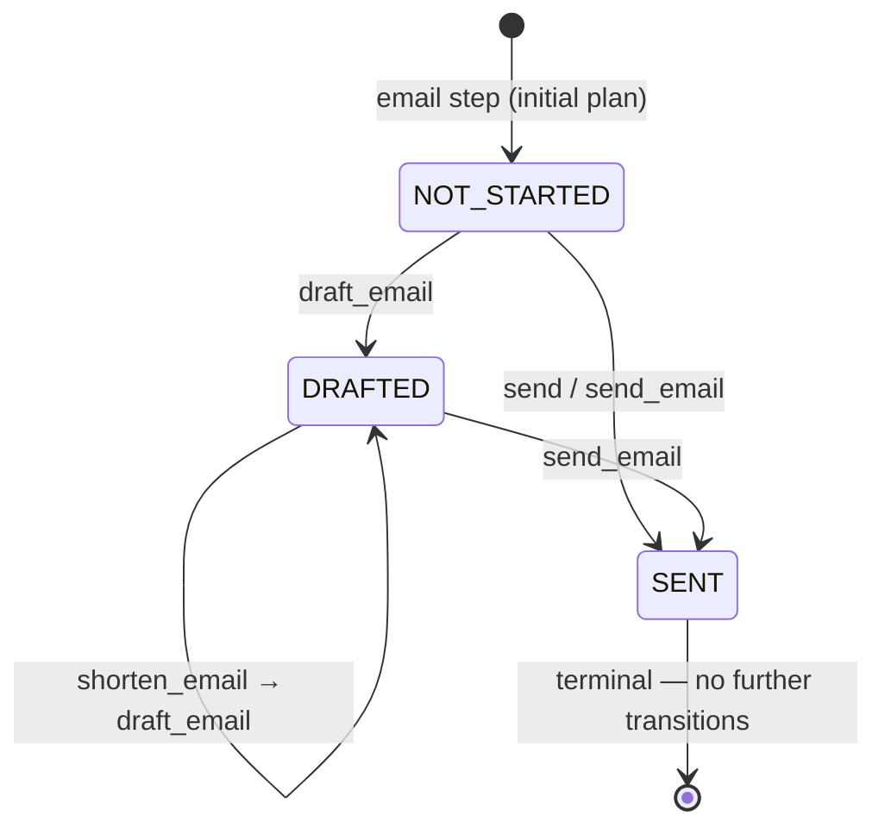

### SMS lifecycle

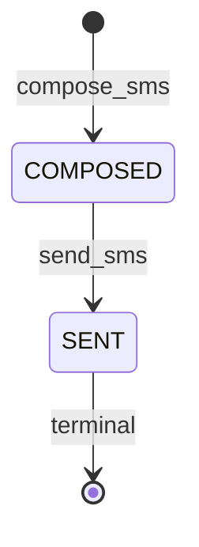

### 2.1 `email` — generate email content

**What it does:** generates email body from the research summary and
stores it in `EmailSnapshot` with status `NOT_STARTED`. No external
side effect — no email is sent or drafted externally.

**Body generation priority:**
1. If `EmailSnapshot.body` already exists → reuse it
2. If `ResearchSnapshot.summary` exists → wrap in email template
   (Hello, summary, citations, Regards)
3. Otherwise → wrap `currentUserRequest` in template

**File:** `EmailToolExecutor.java`

---

### 2.2 `draft_email` — persist draft externally

**What it does:** calls `EmailTool.draftEmail()` which delegates to
`EmailService.createDraft()` — an external side effect that persists
the draft in whatever email system is configured. Updates status to
`DRAFTED`.

**Key detail:** after the `EmailTool` call, the executor does
`stateStore.get(state.sessionId())` to reload state. This is because
`EmailTool.draftEmail()` saves state internally (it calls
`stateStore.save()` with the new `EmailSnapshot`), so the executor
reloads to pick up that change. This is a pattern where two components
(executor + tool) both save state — the reload ensures consistency.

**File:** `DraftEmailToolExecutor.java`

---

### 2.3 `shorten_email` — truncate body

**What it does:** shortens the email body to 300 characters + "..." if
it's longer than 300 characters. Pure state mutation, no external side
effect.

**Body shortening priority:**
1. If `ResearchSnapshot.summary` exists → shorten that and re-wrap in
   email template
2. Otherwise → truncate the existing `EmailSnapshot.body`

Resets status to `NOT_STARTED` so a subsequent `draft_email` will
persist the shortened version.

**File:** `ShortenEmailToolExecutor.java`

---

### 2.4 `update_recipient` — change recipient

**What it does:** replaces `EmailSnapshot.recipient` with the new value.
Resets status to `NOT_STARTED`. No external side effect.

Typically followed by `draft_email` in the planner's continuation plan:
`update_recipient → draft_email` so the draft reflects the new recipient.

**File:** `UpdateRecipientToolExecutor.java`

---

### 2.5 `send` / `send_email` — send externally

**What it does:** calls `EmailTool.sendEmail()` which delegates to
`EmailService.sendEmail()` — the actual external send. Updates status
to `SENT`.

Two tool names that do the same thing:
- `send` — used in initial plans (the planner says "send" for "send
  email now")
- `send_email` — used in continuation plans

Both call the same `EmailTool.sendEmail()` method underneath. The
distinction exists because the planner uses different step vocabularies
for initial vs continuation flows.

**Guard in executor:** `AgentExecutorService.executeToolStep()` checks
`EmailStatus.SENT` before dispatching — if already sent, the step is
logged as `SKIPPED` and no email is re-sent. This provides idempotency.

**Files:** `SendToolExecutor.java`, `SendEmailToolExecutor.java`

---

### 2.6 `compose_sms` — generate SMS content

**What it does:** generates an SMS message from the research summary,
truncated to 160 characters (standard SMS limit), and stores it in
`SmsSnapshot` with status `COMPOSED`.

**Message generation priority:**
1. If `SmsSnapshot.message` already exists → reuse it
2. If `ResearchSnapshot.summary` exists → truncate to 160 chars
3. Otherwise → truncate `currentUserRequest` to 160 chars

**File:** `SmsToolExecutor.java`

---

### 2.7 `send_sms` — send externally

**What it does:** calls `SmsService.sendSms(phone, message)` — the
actual external send. Updates status to `SENT`.

**Guard:** same as email — checks `SmsStatus.SENT` before dispatching.

**File:** `SendSmsToolExecutor.java`

---

### Email/SMS tradeoffs

| Decision | Pro | Con |
|---|---|---|
| State-then-send pattern (email → draft → send) | User can review and modify before sending | Three-step workflow for what could be one step |
| 300-char hard truncation for shorten | Simple, deterministic | Doesn't use the LLM to intelligently summarize — just chops |
| 160-char SMS truncation | Respects standard SMS length | No multi-part SMS support; long messages are silently cut |
| Two names for send (`send` and `send_email`) | Matches planner's different step vocabularies | Confusing to readers; same code path, different names |
| Reload state after EmailTool call | Consistent state after dual-save | Extra Postgres round-trip; fragile pattern if EmailTool save fails |
| Idempotent send guards | Prevents duplicate sends on retry/continuation | Silent skip — user doesn't get explicit feedback that send was skipped |

---

## 3. Vehicle ingestion

Two modes, both producing chunks that end up in the `document_chunks`
table via `PgVectorStore.upsert()`.

### 3.1 Simple ingestion — `VehicleRecord` → 1 chunk

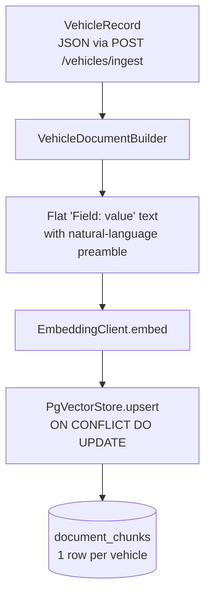

**What `VehicleDocumentBuilder` produces:**

```text
2025 BMW M3 Competition vehicle specification.
Vehicle ID: bmw-m3-2025-competition
Year: 2025
Make: BMW
Model: M3
Trim: Competition
Engine: 3.0L Twin-Turbo I6
Horsepower: 503 hp
...
Summary: [LLM-generated or user-provided]
```

The natural-language preamble ("2025 BMW M3 Competition vehicle
specification.") is critical for embedding quality — it anchors the
entity identity so conversational queries like "what's the horsepower of
the M3" match even though the structured fields below are "Key: Value"
format.

**Persistence:** `upsert` uses `ON CONFLICT (doc_id, chunk_index) DO
UPDATE`, so re-ingesting the same vehicle replaces the existing row in
place. The `doc_id` is a deterministic hash of `vehicleId` via
`Math.abs((long) vehicleId.hashCode())` — stable across re-ingests.

**File:** `VehicleIngestionService.ingestVehicle()`

---

### 3.2 Rich ingestion — `RichVehicleRecord` → N semantic chunks

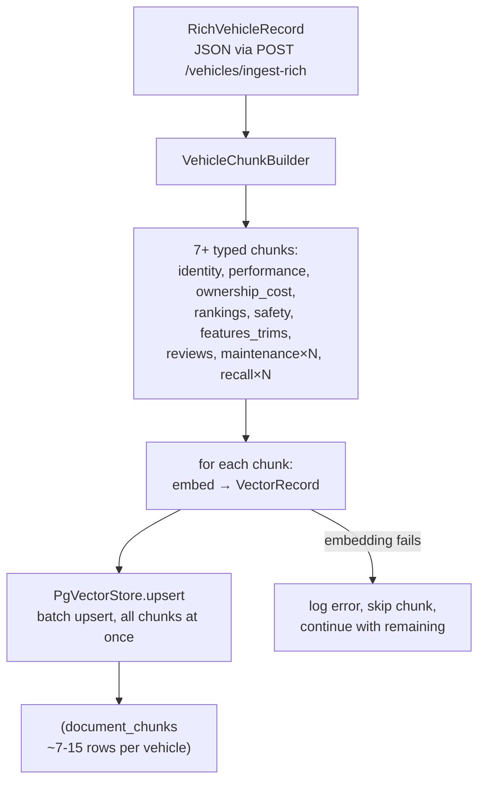

**What `VehicleChunkBuilder` produces:**

Each chunk is scoped to one question category and starts with an
identity anchor:

```text
2025 BMW M3 Competition Luxury Sport Sedan. Performance specs:
Engine: 3.0L Twin-Turbo I6. Horsepower: 503 hp. Torque: 479 lb-ft.
0-60 mph: 3.4 seconds. Top speed: 180 mph. Drivetrain: RWD.
Transmission: 6-speed manual. Fuel economy: 16 city / 23 highway MPG.
```

**Chunk index assignments:**

| Index | Type | What it answers |
|---|---|---|
| 1 | identity | Body style, class, fuel, MSRP, invoice |
| 2 | performance | Engine, hp, torque, 0-60, top speed, drivetrain |
| 3 | ownership_cost | 5-year TCO: fuel, insurance, maintenance, depreciation |
| 4 | rankings | Industry rankings converted to prose ("Ranked 2nd of 18 in sports sedans") |
| 5 | safety | NHTSA, IIHS ratings, active safety features |
| 6 | features_trims | Standard features, trim levels with pricing and added hp |
| 7 | reviews | Expert review scores, summaries, pros/cons |
| 10+ | maintenance | One chunk per mileage milestone (30k, 60k, etc.) |
| 20+ | recall | One chunk per recall record |

**Why "Ranked 2nd of 18" not "rank:2, total:18":**
The chunk builder converts tabular ranking data to prose because the
embedding model (nomic-embed-text) was trained on natural language, not
data tables. "Ranked 2nd of 18 in sports sedans by U.S. News (2025),
score 8.7/100" embeds far better than "rank:2 total:18 category:sports
sedan source:usnews score:8.7" — the natural language version is what
users actually type when asking about rankings.

**Error handling:** if embedding fails for one chunk, the service logs
the error and continues with the remaining chunks. Only if ALL chunks
fail does it throw. This partial-failure tolerance means a single bad
chunk (e.g., unusually long maintenance description that causes an
Ollama timeout) doesn't abort the entire vehicle ingest.

**Files:** `VehicleIngestionService.ingestRichVehicle()`,
`VehicleChunkBuilder.java`, `VehicleDocumentBuilder.java`

---

### Vehicle ingestion tradeoffs

| Decision | Pro | Con |
|---|---|---|
| Separate simple vs rich modes | Backward-compatible; simple mode for basic vehicles, rich mode for detailed data | Two code paths to maintain; chunk index ranges must not collide |
| Identity anchor in every chunk | Retrieval never loses vehicle identity regardless of which chunk is returned | Anchor text is repeated N times in the DB, uses storage |
| One chunk per maintenance interval | "30k service cost" retrieves exactly the right row | Many small chunks for vehicles with extensive maintenance schedules |
| `ordinal()` conversion for rankings | Prose embeds better than tabular data | Brittle for non-English locales |
| Partial-failure tolerance | One bad chunk doesn't abort the whole ingest | Silently incomplete corpus if many chunks fail; no retry mechanism |
| `hashCode()` for stable docId | Deterministic, no timestamp drift | `hashCode()` can collide (two different vehicleIds producing the same long) — unlikely but possible |

---

## 4. Article ingestion

The most sophisticated ingestion pipeline. Designed for long-form CMS
articles (MotorTrend reviews, comparison tests) with many-to-many
vehicle references.

### Flow

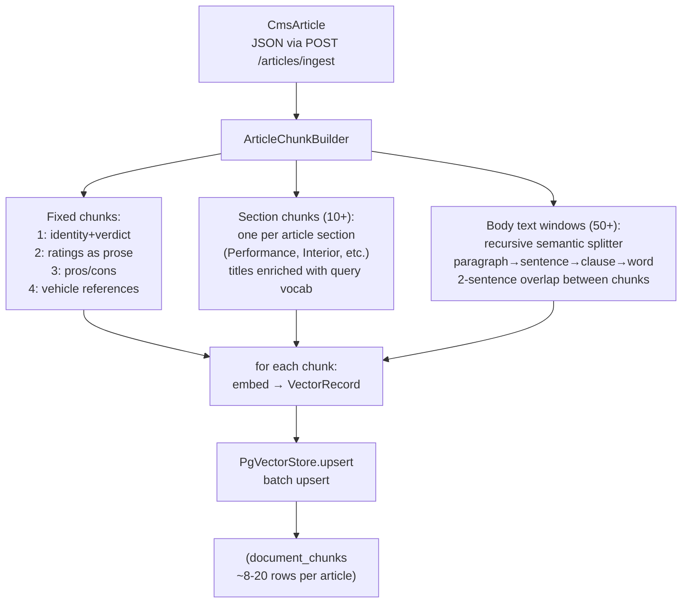

### Chunk index assignments

| Index | Type | What it answers |
|---|---|---|
| 1 | identity_verdict | What is this article about? What's the verdict? |
| 2 | ratings | What scores did the vehicle get? (converted to prose) |
| 3 | pros_cons | What do reviewers like/dislike? |
| 4 | vehicle_references | Which vehicles are in this article? |
| 5–9 | (reserved) | Future: comments_summary, comparison_table, spec_sheet |
| 10+ | section_* | One per article section (Performance, Interior, etc.) |
| 20–49 | (reserved) | Future section types |
| 50+ | body_window | Overlapping body text chunks |

### Many-to-many vehicle anchoring

Every chunk starts with an anchor that names ALL vehicles in the article:

```text
MotorTrend comparison review featuring 2025 BMW M3 Competition,
2025 Porsche 911 Carrera S, 2025 Mercedes-AMG C63. Published 2025-03-15.
```

This is critical for retrieval. Without the anchor, a query for
"Porsche 911 reviews" would only match chunks where "Porsche 911"
happens to appear in the body text. With the anchor, EVERY chunk in the
article is retrievable by any of the three vehicle names — because every
chunk contains all three names in its first sentence.

### Section title enrichment

```text
Before: "Performance"
After:  "Performance and track testing"

Before: "Interior"
After:  "Interior cabin quality and comfort"

Before: "Technology"
After:  "Technology infotainment and features"
```

The raw section title "Performance" doesn't contain the word "track" —
so a user query "how does it perform on track?" might miss this section.
`enrichSectionTitle()` appends query vocabulary so the embedding captures
the words users actually type. This is a deliberate UAC (user-accessible
content) optimization.

### Recursive semantic text splitter

The body text splitter is a four-level recursive algorithm:

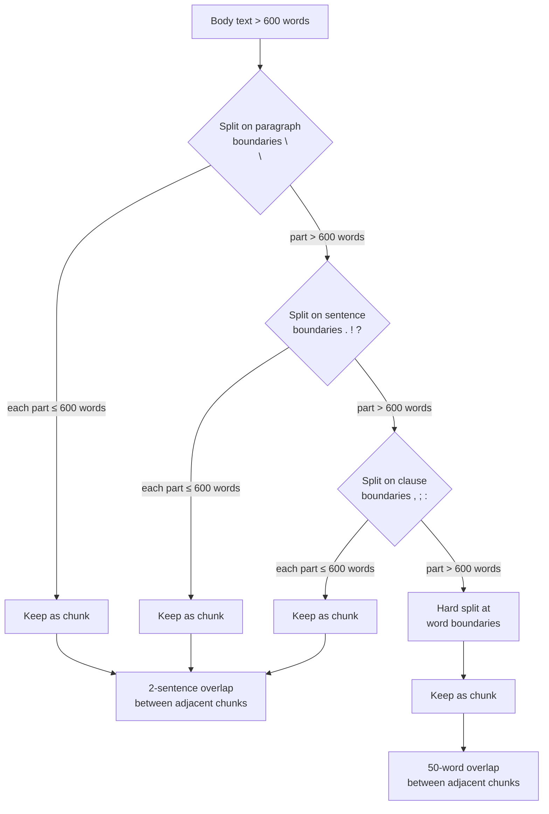

**Why recursive, not fixed-window:**

Fixed-window chunking cuts at exactly N words regardless of semantic
boundaries:

```text
"...The M3 feels engineered to a consistent stan | dard — every system..."
                                              ↑ cut here (mid-word)
```

The recursive splitter cuts at the nearest semantic boundary:

```text
"...The M3 feels engineered to a consistent standard — every system works."
                                                                         ↑ cut here (sentence end)
```

**Overlap is sentence-based, not word-based.** The last 2 sentences of
chunk N become the first 2 sentences of chunk N+1. This means a thought
that spans a boundary always appears complete in at least one chunk —
same guarantee as word overlap but semantically cleaner.

**Constants:**
- `MAX_CHUNK_WORDS = 600` — hard ceiling per chunk
- `MIN_CHUNK_WORDS = 100` — don't create tiny fragments (merged into
  the previous chunk)
- `OVERLAP_SENTENCES = 2` — sentences shared between adjacent chunks

### Ratings-to-prose conversion

Same principle as vehicle rankings:

```text
Before (structured): performance: 9.2, comfort: 8.5, interior: 8.8
After (prose): "MotorTrend rated performance 9.2 out of 10.
               Comfort and ride rated 8.5 out of 10.
               Interior quality rated 8.8 out of 10."
```

The prose version embeds well because the embedding model learned from
natural language. A user asking "how is the interior quality?" will
match "Interior quality rated 8.8 out of 10" better than
"interior: 8.8".

### Article ingestion tradeoffs

| Decision | Pro | Con |
|---|---|---|
| All vehicle names in every chunk anchor | Any vehicle query retrieves the article | Anchor text repeated N times; slightly dilutes the embedding |
| Section title enrichment | Matches user query vocabulary | Must maintain the enrichment map as new section types appear |
| Recursive semantic splitter | Cuts at natural boundaries; no mid-sentence breaks | More complex than fixed-window; harder to debug chunk boundaries |
| 2-sentence overlap | Boundary sentences always appear complete in at least one chunk | Some duplication in the vector store; slightly increases storage |
| Partial-failure tolerance | One bad chunk doesn't abort the ingest | Same risk as vehicle ingestion — silently incomplete corpus |
| Reserved index gaps (5-9, 20-49) | Future chunk types don't require re-indexing existing chunks | Gaps could confuse readers who expect contiguous indices |
| 600-word max per chunk | Fits well within Ollama context window | May split a tightly argued paragraph that should stay together |

---

## Appendix: file map

### Vehicle tools

| File | Role |
|---|---|
| `agentic/tools/vehicle/FetchVehicleSpecsTool.java` | Core logic: embed query, vector search by vehicleId |
| `agentic/tools/vehicle/FetchVehicleSpecsToolExecutor.java` | AgentTool wrapper: args extraction, state update |
| `agentic/tools/vehicle/GenerateVehicleSummaryTool.java` | Core logic: LLM prompt for automotive summary |
| `agentic/tools/vehicle/GenerateVehicleSummaryToolExecutor.java` | AgentTool wrapper: on-demand fetch, dual state write |
| `agentic/tools/vehicle/CompareVehiclesTool.java` | Core logic: multi-vehicle search + comparison prompt |
| `agentic/tools/vehicle/CompareVehiclesToolExecutor.java` | AgentTool wrapper: vehicleIds parsing, state update |
| `agentic/tools/vehicle/EnrichVehicleDataTool.java` | Core logic: LLM-generated summary for VehicleRecord |
| `agentic/tools/vehicle/EnrichVehicleDataToolExecutor.java` | AgentTool wrapper: re-ingestion via VehicleIngestionService |

### Email / SMS tools

| File | Role |
|---|---|
| `agentic/tools/EmailTool.java` | Core email logic: draft/send via EmailService, body generation |
| `agentic/tools/EmailToolExecutor.java` | AgentTool: `email` step — generate body, status NOT_STARTED |
| `agentic/tools/DraftEmailToolExecutor.java` | AgentTool: `draft_email` — persist via EmailTool.draftEmail() |
| `agentic/tools/ShortenEmailToolExecutor.java` | AgentTool: `shorten_email` — truncate to 300 chars |
| `agentic/tools/UpdateRecipientToolExecutor.java` | AgentTool: `update_recipient` — replace recipient in state |
| `agentic/tools/SendToolExecutor.java` | AgentTool: `send` — send via EmailTool.sendEmail() |
| `agentic/tools/SendEmailToolExecutor.java` | AgentTool: `send_email` — same as `send` (continuation alias) |
| `agentic/tools/SmsToolExecutor.java` | AgentTool: `compose_sms` — generate 160-char message |
| `agentic/tools/SendSmsToolExecutor.java` | AgentTool: `send_sms` — send via SmsService |

### Ingestion

| File | Role |
|---|---|
| `rag/ingestion/vehicle/VehicleIngestionService.java` | Simple (1 chunk) + rich (N chunks) vehicle ingestion |
| `rag/ingestion/vehicle/VehicleDocumentBuilder.java` | Flat "Field: value" text builder for simple mode |
| `rag/ingestion/vehicle/VehicleChunkBuilder.java` | Semantic chunk builder: identity, performance, cost, etc. |
| `rag/ingestion/article/ArticleIngestionService.java` | Article ingestion with semantic chunks + sliding windows |
| `rag/ingestion/article/ArticleChunkBuilder.java` | Recursive semantic splitter, multi-vehicle anchoring |
| `domain/vehicle/VehicleRecord.java` | Flat vehicle record (16 fields) |
| `domain/vehicle/RichVehicleRecord.java` | Extended record with safety, maintenance, recalls, reviews |
